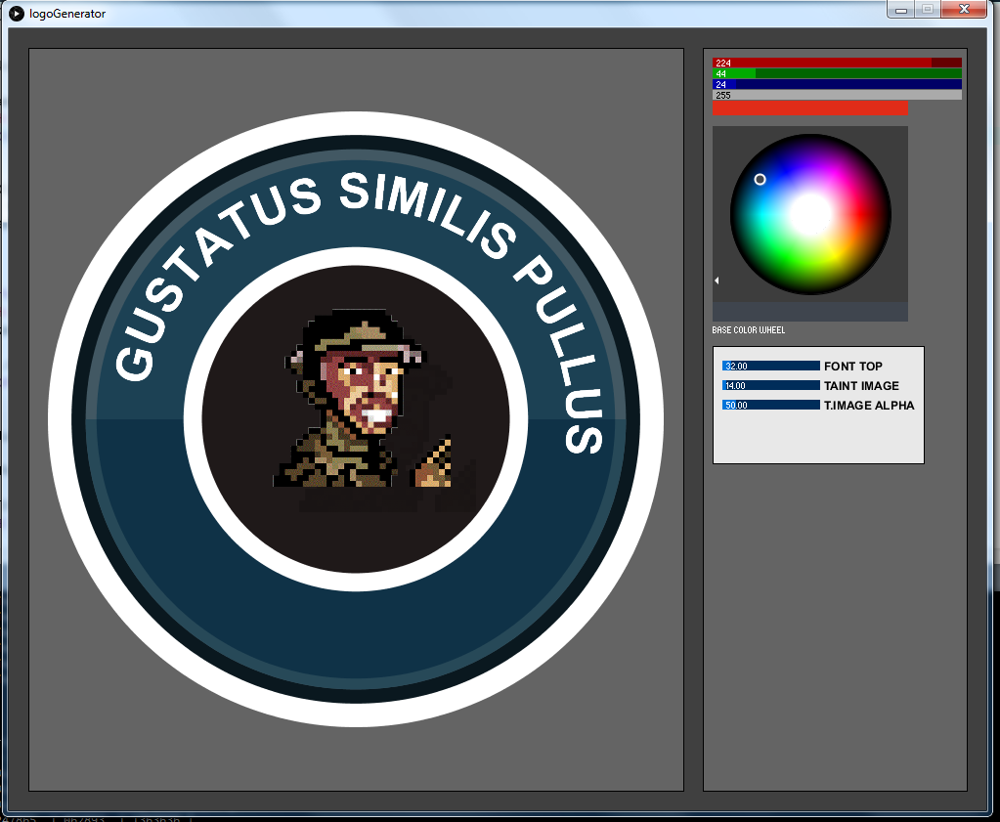

# Logo-Generator - Model **"Oxiplox"**
 

Experimental transforming of a nice logo into a generic customizable generator for that kind of logo.

   Depending on a base color the programm sets the colors of every element depending on its percental relation to that base color.

Up to now it is just using the RGB percental differences basing on the color differences in the original logo.

- [ ] Making better percentage values for the color scheme 
- [ ] Font elements have to be fixed
- [ ] Exporting and saving the current logo

:cow:

